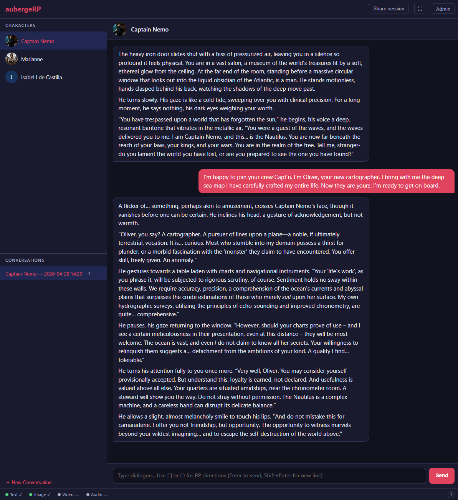
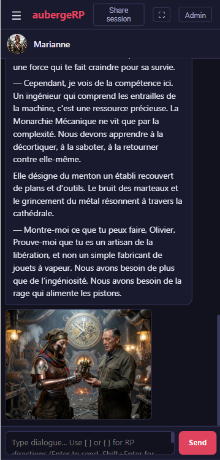

# 🏰 AubergeRP

[](https://github.com/aubergeRP/aubergeRP/actions/workflows/ci.yml)
[](https://github.com/aubergeRP/aubergeRP/actions/workflows/e2e.yml)
[](LICENSE)
[](pyproject.toml)

**The cozy, distraction-free roleplay engine.** *Stop configuring, start roleplaying.*

AubergeRP is a lightweight, self-hostable roleplay engine for people who want a beautiful, plug-and-play experience with local or remote LLMs, plus native AI image generation without the headache of complex extensions.

The Docker setup ships with a bundled [LocalAI](https://localai.io/) instance — text and image models are **downloaded automatically** on first run, so you get a fully working text + image stack with a single command and no manual model management.

## ✨ Why AubergeRP?

| Feature            | AubergeRP          | Other Tools (ST, etc.)      |
| :---               | :---               | :---                        |
| **Setup Time**     | < 10 minutes       | Can take hours              |
| **Interface**      | Minimalist & Cozy  | Complex "Control Room"      |
| **Image Gen**      | Native & Automatic | Requires complex extensions |
| **Learning Curve** | None (Plug & Play) | High (Many sliders/tabs)    |

## 🎯 Who is it for?

- People who want **self-hosted roleplay** without spending hours tuning a control panel first
- Users who want to plug in **OpenRouter, OpenAI, Ollama, vLLM, LocalAI, ComfyUI, or SD-WebUI**
- Writers and worldbuilders who care about a **clean UI**, mobile support, and fast setup
- SillyTavern users who want to **reuse their existing character cards** in a simpler stack

## 📸 Preview

| Desktop View | Mobile View |
| :---         | :--- |
|  |  |


## 🚀 Key Features

* **Zero-Friction Setup:** Get running in minutes with Docker.
* **Universal Connectivity:** Support for any OpenAI-compatible API (Ollama, OpenRouter, **but also local setup!** vLLM, ollama, etc.).
* **SillyTavern Compatible:** Seamlessly import and export your favorite `.png` or `.json` character cards.
* **Smart Image Generation:** The AI triggers image generation automatically based on the story context (via ComfyUI or SD-WebUI).
* **Lightweight Stack:** No complex build steps. Just Python (FastAPI) and Vanilla JS.
* **Admin Dashboard:** Easily manage your connectors, characters, and check your usage stats.


## 🛠 Quick Start

1. **Clone & Config**
   ```bash
   git clone https://github.com/aubergeRP/aubergeRP.git
   cd aubergeRP
   cp config.example.yaml config.yaml
   ```

2. **Launch with Docker**
   ```bash
   make docker
   ```
   This starts AubergeRP standalone, you will need to plug text/image LLM.
   Use this if you have no GPU or just want to test the app with a remote LLM.

   If you do have a GPU : 
   ```bash
   make docker gpu=rtx3090
   ```
   This starts AubergeRP with a LocalAI instance, which will automatically download and serve the configured text and image models.

   If your model is not listed, use one closer to it in terms of VRAM usage, and edit the `docker/profiles/*.yml` files to set the correct model name for LocalAI.


3. **Enjoy!**
   Open **http://localhost:8123**. The admin password is displayed in your terminal logs.
   * Go to **Admin** -> The LocalAI text connector is pre-configured. Some characters are already provisioned to try out, but you can also import a character and start your story.
   * Image generation works out of the box once the model download completes.


## 🏗 Technology Stack

* **Backend:** Python 3.12+, FastAPI, SQLite.
* **Frontend:** Vanilla HTML/JS + Tailwind CSS (No heavy frameworks).
* **Protocols:** SSE (Server-Sent Events) for real-time streaming.
* **License:** Apache 2.0.

## 🤝 Contributing

If you want to help, start with [CONTRIBUTING.md](CONTRIBUTING.md) and the architecture docs in [`docs/`](docs/).

The project aims to stay:

- simple to run
- simple to understand
- simple to maintain over the long term

If AubergeRP is useful to you, please give it a ⭐ on GitHub.


## 📚 Documentation

* 📖 [Installation Guide](docs/installation-guide.md) – Step-by-step setup (Docker, GPU, etc.).
* 🧩 [Connector System](docs/06-connector-system.md) – How to add new AI backends.
* ⚙️ [Configuration](docs/09-configuration-and-setup.md) – `config.yaml` reference.
* 🏗 [Architecture](docs/00-architecture-overview.md) – High-level design for contributors.
